# Nexus Automation Engine — Showcase

A scrollable tour of the platform. Nexus is a **vendor- and platform-agnostic automation control
plane**: engineers govern *what can run*, operators *compose and run* it on a visual canvas, and
every change is schema-checked, idempotent, human-reviewed, and versioned in Git.

> Everything below runs against a **stateful simulation layer** — no real backends required. There
> is **no AI in the product**; every "smart" output (health, drift, review packets, coverage) is
> computed deterministically. See the [README](README.md) for the full doc & spec index.

**Jump to:** [Operate](#operate) · [Compose & Run](#compose--run) · [Govern Every Change](#govern-every-change) · [Configuration Management](#configuration-management) · [Platform & Experience](#platform--experience)

---

## Operate

### Operations Dashboard

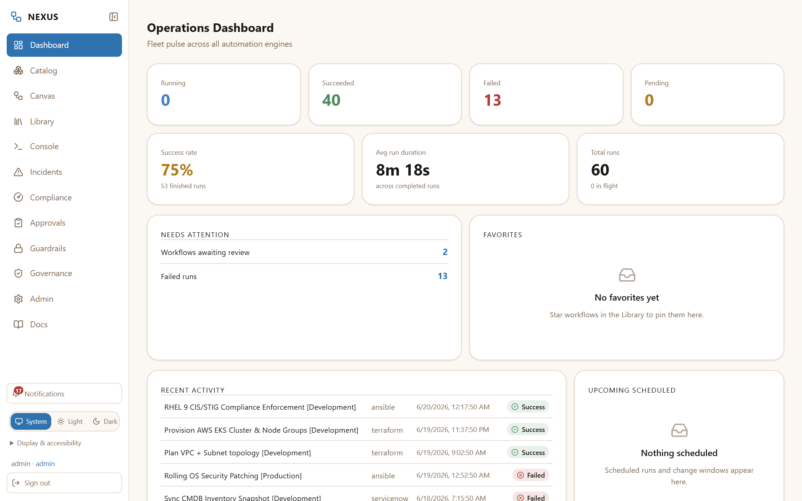

- **What it's for** — the single pane of glass for fleet health: running / succeeded / failed /
  pending counts, success rate, average duration, and total runs across every automation engine.
- **How it helps** — a **Needs-attention** card surfaces workflows awaiting review, failed runs, and
  stale automations so nothing slips; **Favorites** and **Recent activity** keep your day's work one click away.
- **Where the data comes from** — a lived-in, seeded run history so the fleet pulse is meaningful
  the moment you log in.

### Incidents

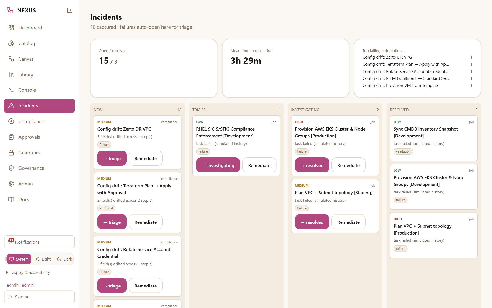

- **What it's for** — failures *and* configuration drift automatically open incident cards on a
  triage board (New → Triage → Investigating → Resolved).
- **How it helps** — each card carries a failure-mode tag and "similar past failures," and converts
  to a **remediation workflow** in one click — turning an outage into a repeatable fix.
- **At a glance** — a trends row shows MTTR and the top failing automations, so you fix the
  systemic problems, not just the symptom.

---

## Compose & Run

### Service Catalog

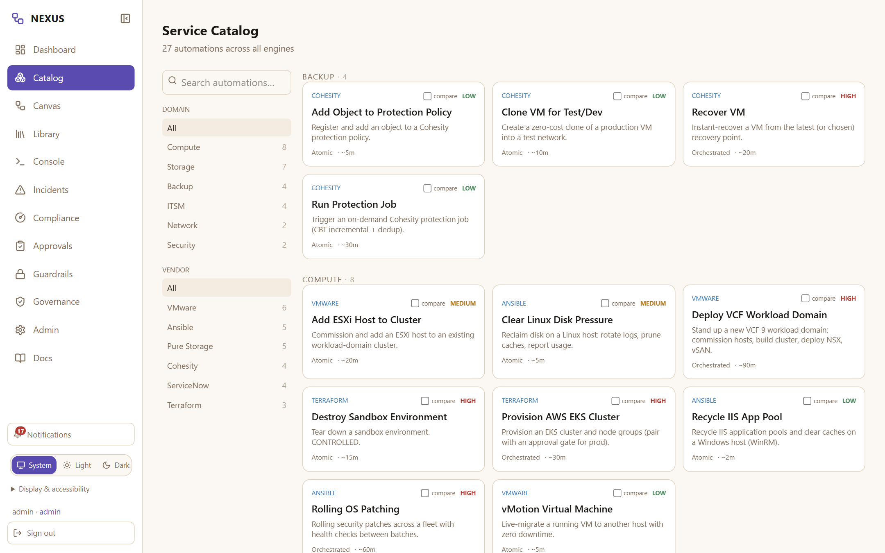

- **What it's for** — the library of approved **atomic building blocks**, faceted by domain and
  vendor (VMware, Ansible, Terraform, Cohesity, ServiceNow, Pure, …).
- **How it helps** — every card shows risk, type, and duration; the detail drawer adds an
  "in plain language" summary, an idempotency chip, parameters, and an animated **Logic Flow**.
- **Safe to explore** — run a block in **check-mode** or **Check compliance** (a drift report with
  no mutation) before you ever change anything.

### Orchestration Canvas

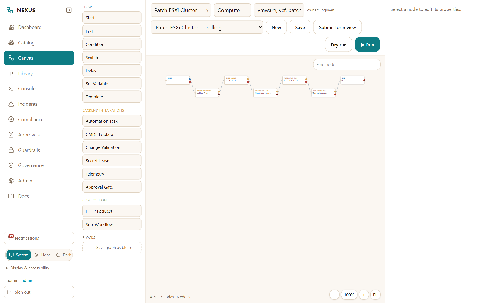

- **What it's for** — compose workflows visually from flow nodes, backend integrations, and
  composition blocks; here a real "Patch ESXi Cluster — rolling" graph (7 nodes) is loaded.
- **How it helps** — **Start from catalog item** pre-fills a vetted block's connector/action/params;
  **Sub-Workflow** reuses any saved + approved workflow as a node; inline lint flags structural problems.
- **Run with confidence** — **Dry run** plans the whole DAG with nothing mutating; **Run** executes
  (and is automatically blocked by approval when the change policy requires it).

### Workflow Library

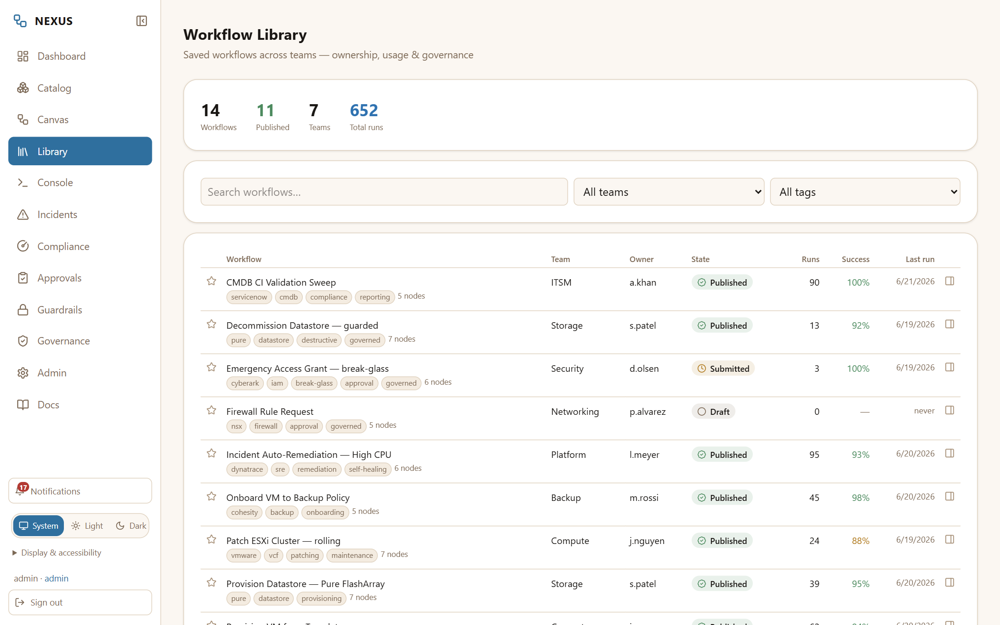

- **What it's for** — every saved workflow across teams, with ownership, usage, success rate, and
  review state in one filterable place.
- **How it helps** — drill into run history, **replay** a past run, or **retry** a failed one;
  submit drafts for review without leaving the page.
- **Why it matters** — turns one-off automations into a governed, discoverable, reusable inventory.

### Live Console

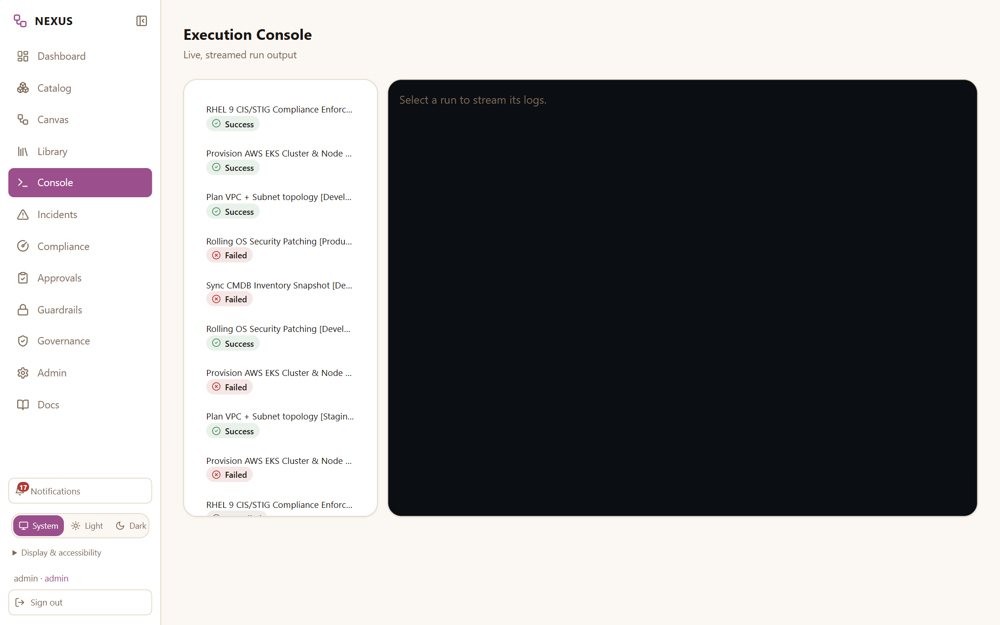

- **What it's for** — live, streamed run output with realistic ANSI logs as the job lifecycle plays out.
- **How it helps** — an in-run **filter** and **download log** make triage fast, whether you're
  watching a run live or reviewing one after the fact.
- **Realistic by design** — the simulation layer streams true-to-life logs and timing, so the
  console is demonstrable end-to-end.

---

## Govern Every Change

### Approvals — Multi-Audience Review

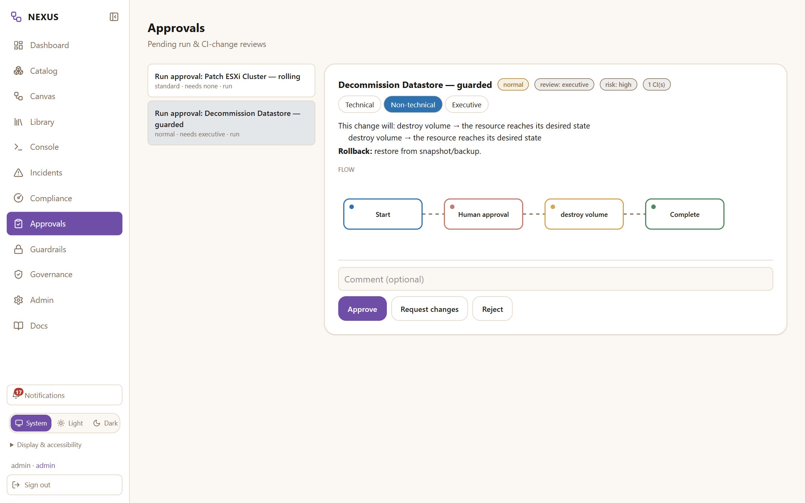

- **What it's for** — the human gate before a risky run. Each pending item renders a **Change Review
  Packet** with **Technical / Non-technical / Executive** views of the *same* change.
- **How it helps** — reviewers see a plain-language summary, rollback plan, a human-readable
  **flowchart** (Start → Human approval → action → Complete), and risk / review-level / blast-radius badges.
- **Deterministic, not AI** — the packet is *composed* from the workflow graph and each block's
  authored summary; identical input always yields the identical packet.
- **The decision** — approve, request changes, or reject, with an optional comment — and the run is
  gated until it's approved.

### Determinism & Guardrails

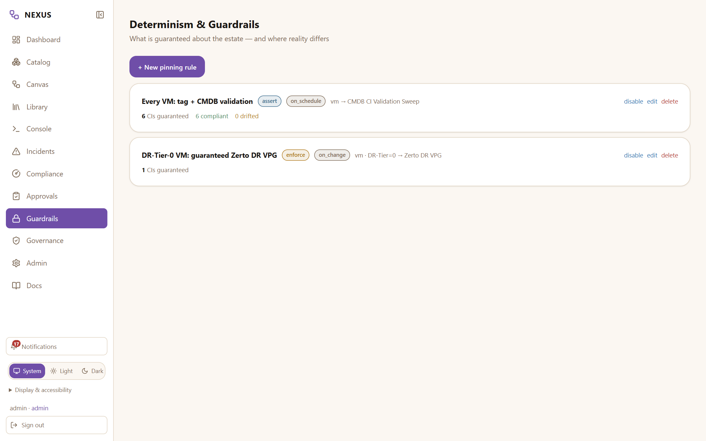

- **What it's for** — author **pinning rules** that guarantee a workflow for a class of CI
  (selector → workflow + trigger + enforcement: assert / enforce / gate).
- **How it helps** — the coverage panel answers *"what is guaranteed about my estate, and where does
  reality not match?"* — matched CIs, compliant vs drifted, and missing-workflow warnings.
- **Real examples** — "Every VM: tag + CMDB validation" (6/6 compliant) and "DR-Tier-0 VM →
  guaranteed Zerto DR VPG" — desired state expressed as policy, not tribal knowledge.

### Governance

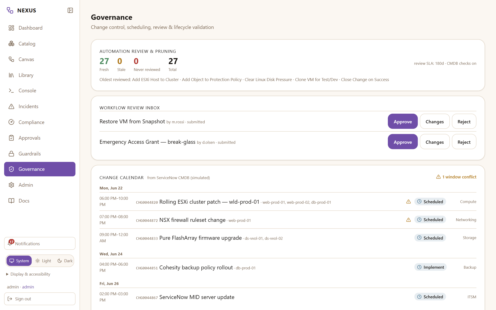

- **What it's for** — the engineer's control surface: workflow review inbox (approve / request
  changes / reject), the validation-policy editor, and automation review/pruning.
- **How it helps** — a **change calendar** (from the simulated ServiceNow CMDB) flags scheduling
  conflicts before a change lands.
- **Why it matters** — this is where "build it once, govern it centrally" is enforced.

---

## Configuration Management

### CMDB Schema Studio

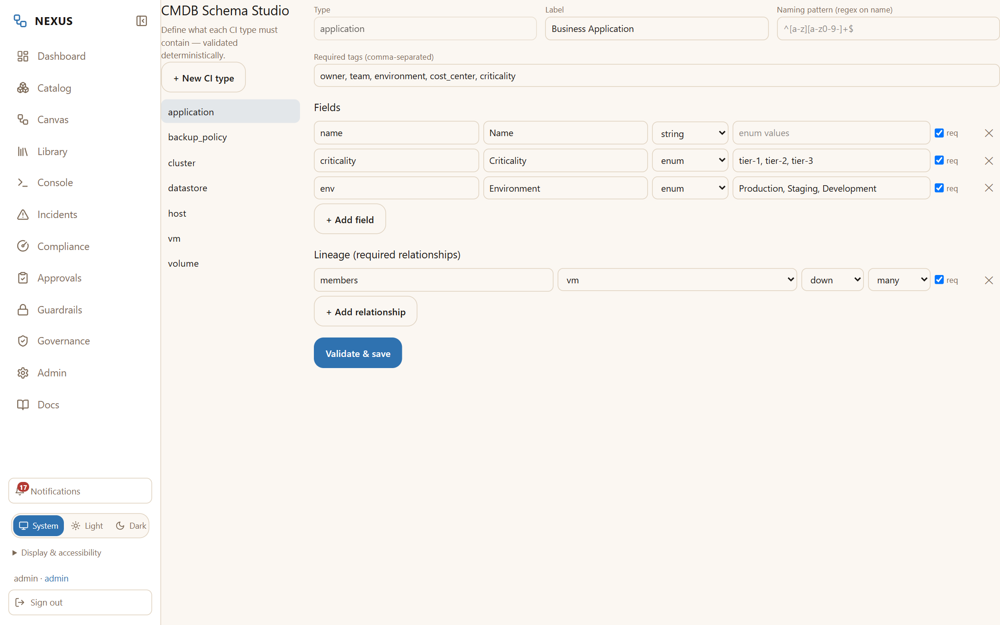

- **What it's for** — define each CI type as a **contract**: fields, required tags, naming pattern,
  and lineage (the typed required relationships between CI types).
- **How it helps** — schemas are validated deterministically on save, so the CMDB can't drift into
  an inconsistent shape.
- **Foundation** — every downstream check (health, lineage, compliance, lifecycle gating) is built
  on these schemas.

### CMDB Lineage Explorer

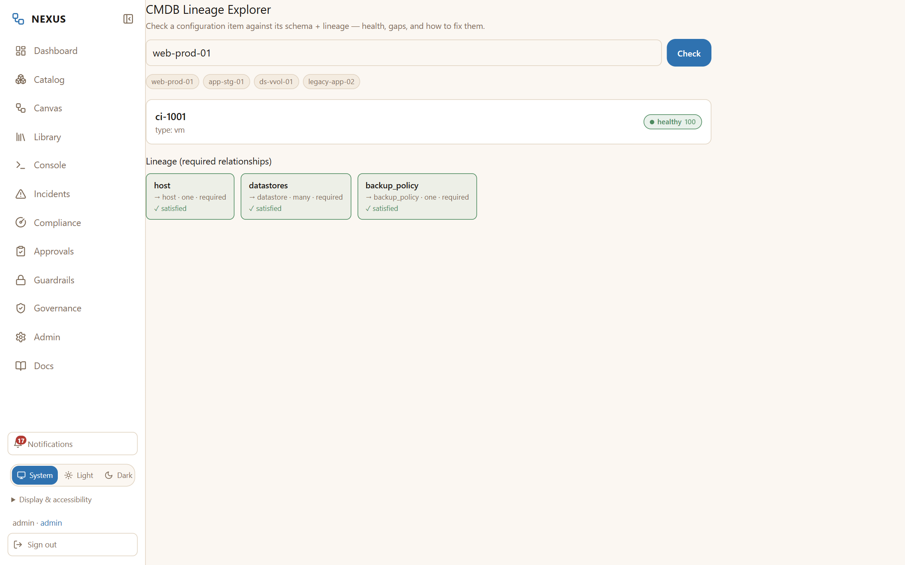

- **What it's for** — look up any configuration item and check it against its schema + lineage.
- **How it helps** — shows a **health score** (here ci-1001, *healthy 100*) and each required
  relationship (host, datastores, backup_policy) with a satisfied / gap indicator and remediation hints.
- **Why it matters** — turns "is this CI trustworthy?" from a guess into a deterministic answer.

### Compliance Posture

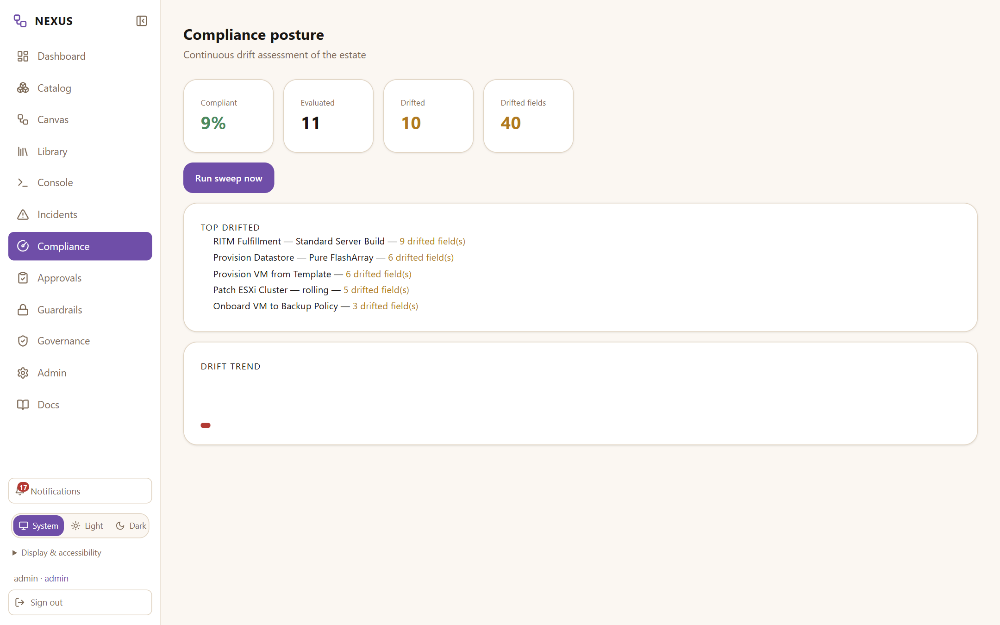

- **What it's for** — continuous drift assessment of the whole estate from scheduled sweeps:
  % compliant, evaluated, drifted, and total drifted fields.
- **How it helps** — a **Top drifted** list and a drift-trend sparkline focus remediation where it
  matters; admins can **Run sweep now** on demand.
- **The mandate** — because all automation is idempotent, *any* workflow can be re-run for
  compliance to reveal desired-vs-observed differences without side effects.

### GitOps — Config as Code

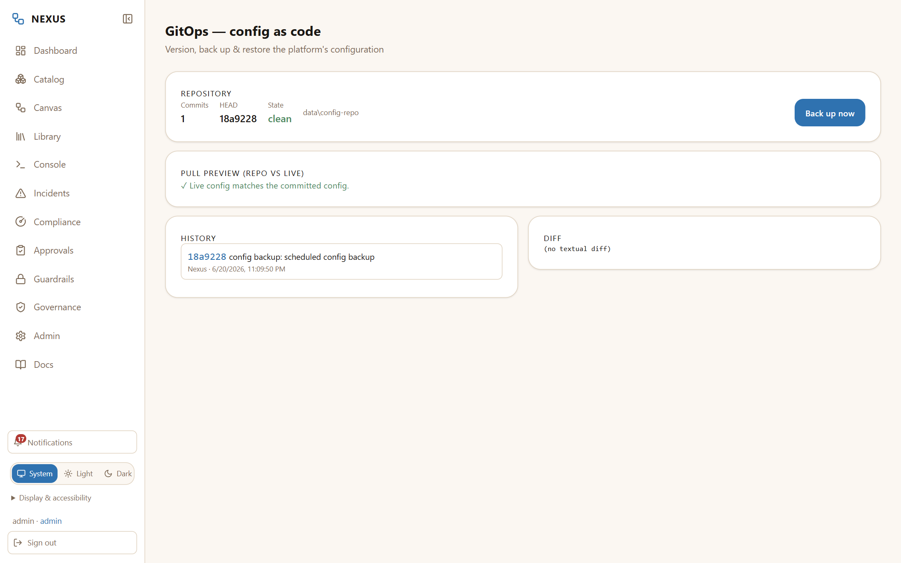

- **What it's for** — the platform versions its own configuration in a **local Git repo**: commit
  history, HEAD, and a clean/dirty status.
- **How it helps** — **Back up now** commits a canonical snapshot; **pull-preview** compares the
  live config against the committed config ("✓ Live config matches the committed config").
- **Recoverable** — browse history, view a commit's **diff**, and **restore** a prior version.
  Local git only — no remotes, no external services.

---

## Platform & Experience

### Admin

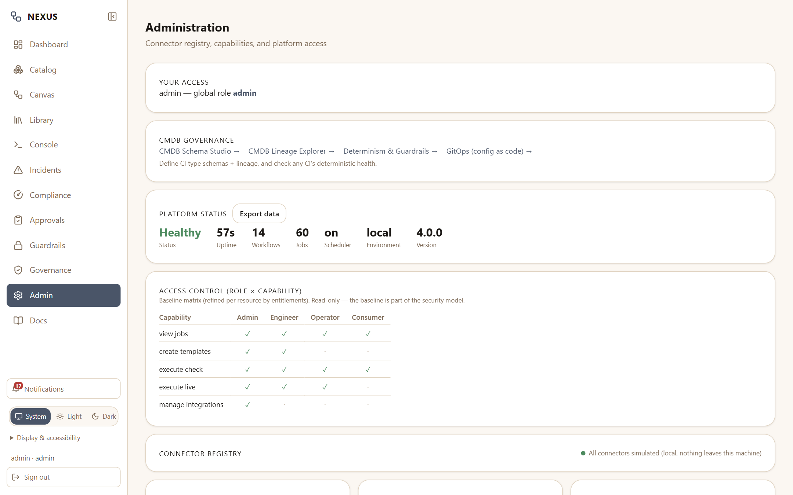

- **What it's for** — your access and the **RBAC role × capability matrix**, platform runtime
  status, the connector registry, and a data export/backup bundle.
- **How it helps** — a launch point into the CMDB, Guardrails, and GitOps governance surfaces.
- **Scope-aware** — admin-only actions are gated; everyone else sees exactly what their role allows.

### Theme Studio

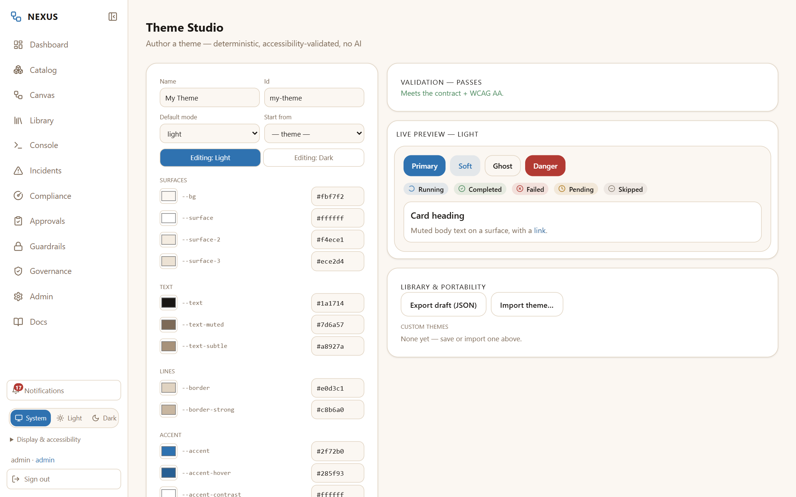

- **What it's for** — author and preview themes with a deterministic **WCAG contrast validator**.
- **How it helps** — 10 built-in themes plus light/dark/sundown modes and per-area overrides; the
  validator catches unreadable or colliding color tokens before they ship.
- **Polished** — the look and feel is a first-class, governed part of the product, not an afterthought.

### Accessibility Center

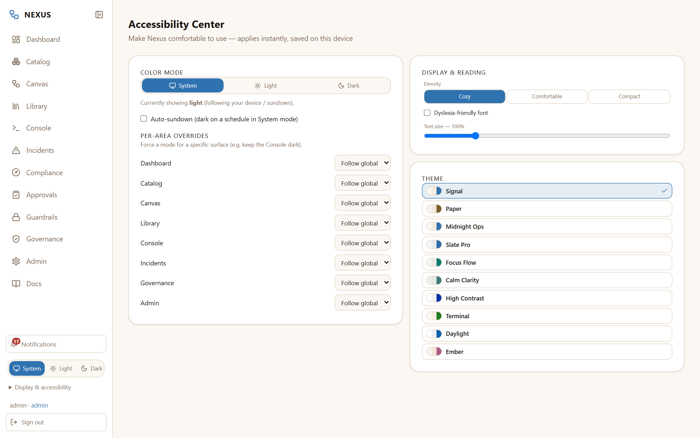

- **What it's for** — per-user display controls: color mode, density, dyslexia-friendly font, and
  text scale.
- **How it helps** — preferences persist and apply across every surface, so the platform adapts to
  the operator rather than the other way around.
- **Inclusive by default** — accessibility is built in, with a structural a11y test suite backing it.

### In-app Documentation

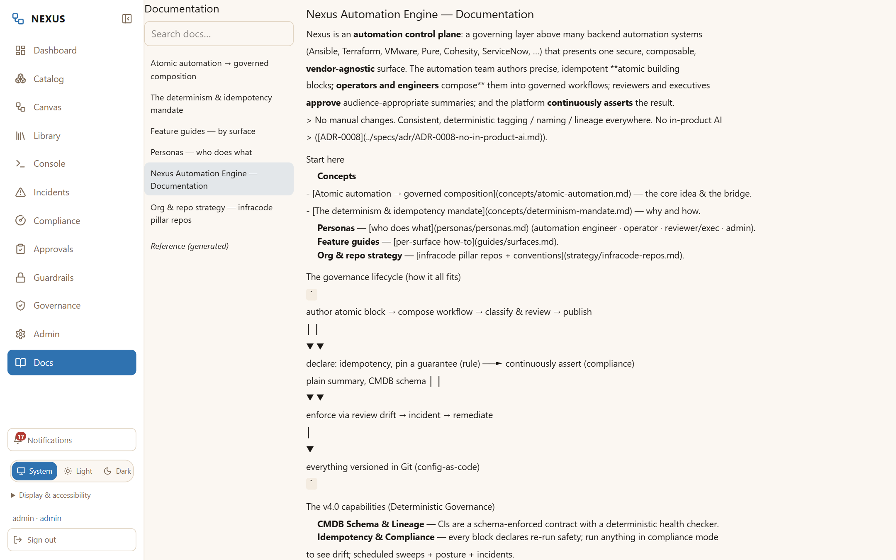

- **What it's for** — the authored `docs/` tree served *inside* the app (concepts, personas, feature
  guides, repo strategy) with a searchable sidebar.
- **How it helps** — includes a **generated reference** built from live data (connector blocks, CMDB
  schemas, pinning rules) so reference docs can't drift from reality.
- **Single source of truth** — the same Markdown that lives in the repo is what you read in-app.

### Secure Access

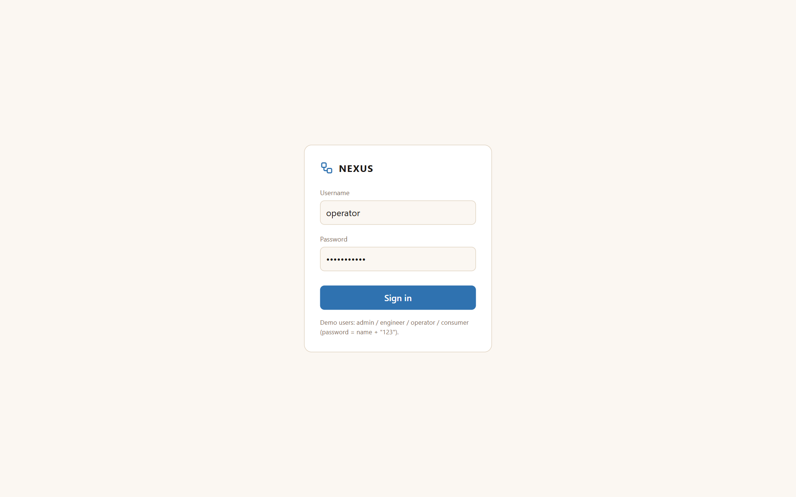

- **What it's for** — JWT-backed authentication with role-based access (admin / engineer / operator / consumer).
- **How it helps** — every surface and action is gated by role, so self-service stays inside the
  guardrails engineers define.
- **Demo-ready** — seeded demo users make the whole governed flow explorable in seconds.

---

*Screenshots are captured from the running application (simulation mode) at `v4.0.0 — Deterministic
Governance`. To regenerate them, run the app and walk the surfaces listed in
[`docs/guides/surfaces.md`](docs/guides/surfaces.md).*
